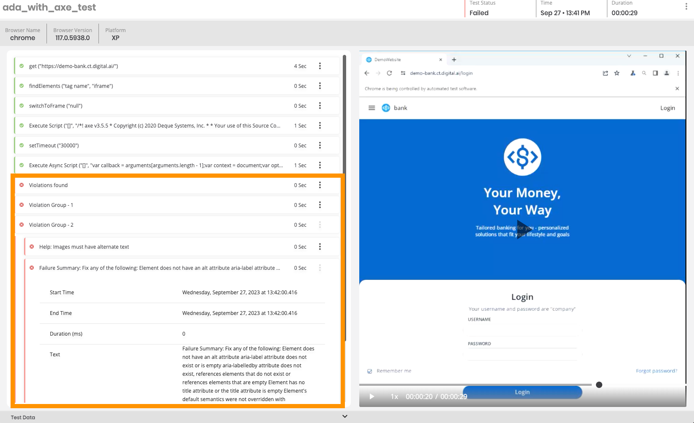

## Digital.ai Continuous Testing - Cross Browser Tests integrated with Axe for Accessibility Testing

In this code example, we look at how we can utilize Deque Axe's Libraries to scan different pages on Web Applications.

By scanning the pages, we can quickly identify if there are any WCAG related violations that needs addressing.

Here is an example report generated within Digital.ai's Continuous Testing platform:

